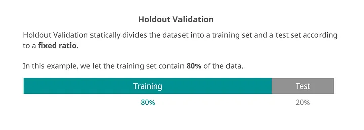
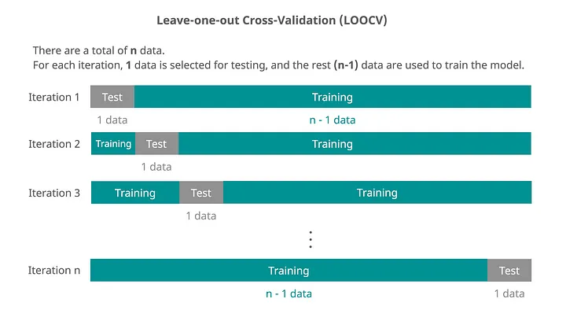
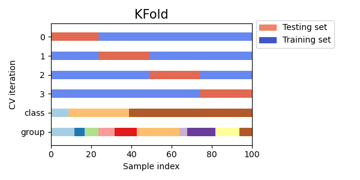
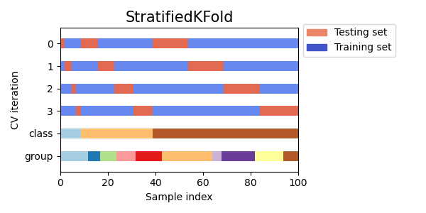
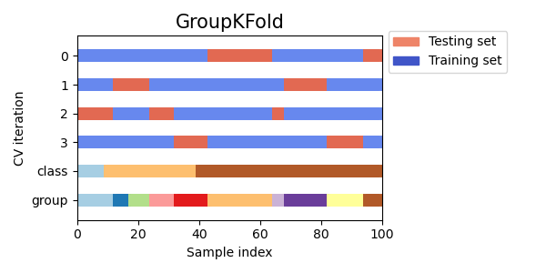
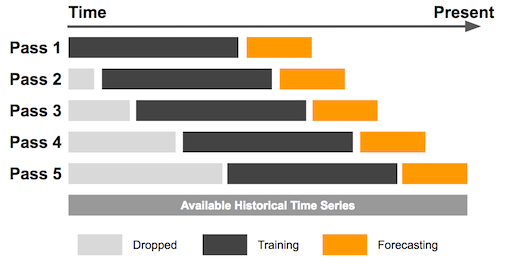
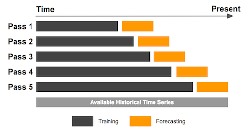
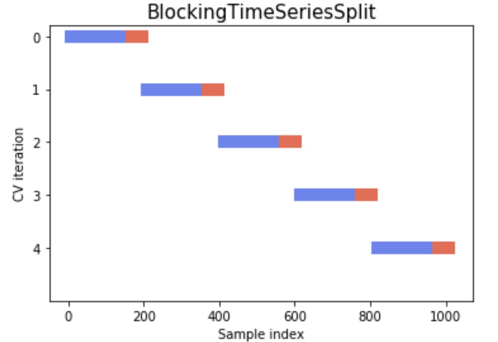

# Cross-validation methods

## 0. 모델을 학습하기 위해 전체 데이터를 학습데이터와 평가데이터로 나누는 과정이 필요

### 0-1. 학습/평가 데이터를 나누는 가장 기본적인 **hold-out** 방식



[Image Source](https://medium.com/@hahahumble/cross-validation-clearly-explained-in-5-graphs-9b83067bc696)

<br>


```python
import numpy as np
from sklearn.model_selection import train_test_split

X = np.arange(15)
X_train, X_test = train_test_split(X, test_size=0.2, random_state=123)
print("TRAIN:", X_train)
print("TEST:", X_test)

# TRAIN: [ 0  5  9  8 11  3  1  6 12  2 13 14]
# TEST: [ 7 10  4]
```

> - Hold-out 방식은 데이터 분할에 따라 성능이 크게 달라질 수 있어 일반화 성능이 불안정하다.    
> - Cross-validation은 데이터를 여러 번 나누어 학습함으로써 더 안정적이고 신뢰할 수 있는 성능 평가를 가능케 한다.

<br>

## 1. Cross-sectional data 에서 Cross-validation methods


### 1-1. **Leave-One-Out CV (LOOCV)**
* 하나의 데이터를 테스트셋으로, 나머지를 학습셋으로 사용. 이 과정을 모든 데이터에 반복
* 작은 데이터셋에서 학습 능력을 극대화하고 싶을 때



[Image Source](https://medium.com/@hahahumble/cross-validation-clearly-explained-in-5-graphs-9b83067bc696)

<br>


```python
import numpy as np
from sklearn.model_selection import LeaveOneOut

X = np.arange(5)

for train_idx, test_idx in LeaveOneOut().split(X):
    print("TRAIN:", train_idx, "/ Values:", X[train_idx])
    print("TEST: ", test_idx,  "/ Value: ", X[test_idx])
    print()

# TRAIN: [1 2 3 4] / Values: [1 2 3 4]
# TEST:  [0] / Value:  [0]

# TRAIN: [0 2 3 4] / Values: [0 2 3 4]
# TEST:  [1] / Value:  [1]

# TRAIN: [0 1 3 4] / Values: [0 1 3 4]
# TEST:  [2] / Value:  [2]

# TRAIN: [0 1 2 4] / Values: [0 1 2 4]
# TEST:  [3] / Value:  [3]

# TRAIN: [0 1 2 3] / Values: [0 1 2 3]
# TEST:  [4] / Value:  [4]
```

<br>

### 1-2. **Standard K-Fold CV**
* 데이터를 k개의 동일한 크기의 폴드로 나눈 후 각 폴드를 한 번씩 테스트셋으로 사용
* 균형 잡힌 데이터셋에서 보편적으로 사용



[Image Source](https://scikit-learn.org/stable/auto_examples/model_selection/plot_cv_indices.html#sphx-glr-auto-examples-model-selection-plot-cv-indices-py)

<br>

```python
import numpy as np
from sklearn.model_selection import KFold

X = np.arange(15)
kf = KFold(n_splits=3, shuffle=True, random_state=123)
for train_idx, test_idx in kf.split(X):
    print("TRAIN:", train_idx, "TEST:", test_idx)

# TRAIN: [ 1  2  3  6  8  9 11 12 13 14] TEST: [ 0  4  5  7 10]
# TRAIN: [ 0  2  4  5  6  7 10 12 13 14] TEST: [ 1  3  8  9 11]
# TRAIN: [ 0  1  3  4  5  7  8  9 10 11] TEST: [ 2  6 12 13 14]    
```

<br>

### 1-3. **Stratified K-Fold CV**
* 원래 데이터셋의 클래스 비율을 각 폴드에서도 동일하게 유지함 
* 클래스 불균형이 있는 분류 문제에서 클래스 비율을 유지하고자 할 때



[Image Source](https://scikit-learn.org/stable/auto_examples/model_selection/plot_cv_indices.html#sphx-glr-auto-examples-model-selection-plot-cv-indices-py)

<br>


```python
import numpy as np
from collections import Counter
from sklearn.model_selection import StratifiedKFold

X = np.arange(15)
y = [0, 0, 0, 0, 0, 1, 1, 1, 1, 1, 1, 1, 1, 1, 1]
skf = StratifiedKFold(n_splits=3, shuffle=True, random_state=123)

for train_idx, test_idx in skf.split(X, y):
    y_train = np.array(y)[train_idx]
    y_test = np.array(y)[test_idx]

    print("TRAIN:", train_idx, " / Class count:", dict(Counter(y_train)))
    print("TEST: ", test_idx,  " / Class count:", dict(Counter(y_test)))
    print()

# TRAIN: [ 1  2  4  5  6  7  9 10 11 13]  / Class count: {0: 3, 1: 7}
# TEST:  [ 0  3  8 12 14]  / Class count: {0: 2, 1: 3}

# TRAIN: [ 0  2  3  5  6  8 10 11 12 14]  / Class count: {0: 3, 1: 7}
# TEST:  [ 1  4  7  9 13]  / Class count: {0: 2, 1: 3}

# TRAIN: [ 0  1  3  4  7  8  9 12 13 14]  / Class count: {0: 4, 1: 6}
# TEST:  [ 2  5  6 10 11]  / Class count: {0: 1, 1: 4}
```

<br>

### 1-4. **Group K-Fold CV** 
* 동일 그룹이 학습셋과 테스트셋에 동시에 포함되지 않도록 나눔
* 데이터 샘플 간 독립성이 없는 경우 그룹 단위 성능 평가에 적합



[Image Source](https://scikit-learn.org/stable/auto_examples/model_selection/plot_cv_indices.html#sphx-glr-auto-examples-model-selection-plot-cv-indices-py)

<br>


```python
import numpy as np
from sklearn.model_selection import GroupKFold

X = np.arange(10)
groups = np.array([1, 1, 1, 2, 2, 3, 3, 3, 4, 4])  # 같은 그룹끼리는 분리됨
gkf = GroupKFold(n_splits=3, shuffle=True, random_state=123)

for train_idx, test_idx in gkf.split(X, groups=groups):
    print("TRAIN:", train_idx, " / Group:", np.unique(groups[train_idx]))
    print("TEST: ", test_idx,  " / Group:", np.unique(groups[test_idx]))
    print()

# TRAIN: [3 4 5 6 7]  / Class: [2 3]
# TEST:  [0 1 2 8 9]  / Class: [1 4]

# TRAIN: [0 1 2 5 6 7 8 9]  / Class: [1 3 4]
# TEST:  [3 4]  / Class: [2]

# TRAIN: [0 1 2 3 4 8 9]  / Class: [1 2 4]
# TEST:  [5 6 7]  / Class: [3]
```

<br>

## 2. Time series data 에서 Cross-validation methods
look-ahead bias 방지를 위해 일반적인 CV method 사용 불가

### 2-1.  **Rolling Window CV**



[Image Source](https://www.kaggle.com/code/cworsnup/backtesting-cross-validation-for-timeseries/notebook)

<br>


```python
import numpy as np
from sklearn.model_selection import TimeSeriesSplit

x = np.arange(15)
cv = TimeSeriesSplit(max_train_size=3, test_size=1)
for train_index, test_index in cv.split(x):
    print("TRAIN:", train_index, "TEST:", test_index)

# TRAIN: [7 8 9] TEST: [10]
# TRAIN: [8 9 10] TEST: [11]
# TRAIN: [9 10 11] TEST: [12]
# TRAIN: [10 11 12] TEST: [13]
# TRAIN: [11 12 13] TEST: [14]
```

<br>

### 2-2.**Expanding Window CV**



[Image Source](https://www.kaggle.com/code/cworsnup/backtesting-cross-validation-for-timeseries/notebook)

<br>


```python
import numpy as np
from sklearn.model_selection import TimeSeriesSplit

x = np.arange(15)
cv = TimeSeriesSplit(n_splits=8, test_size=1)
for train_index, test_index in cv.split(x):
    print("TRAIN:", train_index, "TEST:", test_index)

# TRAIN: [0 1 2 3 4 5 6] TEST: [7]
# TRAIN: [0 1 2 3 4 5 6 7] TEST: [8]
# TRAIN: [0 1 2 3 4 5 6 7 8] TEST: [9]
# TRAIN: [0 1 2 3 4 5 6 7 8 9] TEST: [10]
# TRAIN: [0 1 2 3 4 5 6 7 8 9 10] TEST: [11]
# TRAIN: [0 1 2 3 4 5 6 7 8 9 10 11] TEST: [12]
# TRAIN: [0 1 2 3 4 5 6 7 8 9 10 11 12] TEST: [13]
# TRAIN: [0 1 2 3 4 5 6 7 8 9 10 11 12 13] TEST: [14]
```

<br>

### 2-3. **Blocked CV**



[Image Source](https://www.packtpub.com/en-us/learning/how-to-tutorials/cross-validation-strategies-for-time-series-forecasting-tutorial/)

<br>


```python
import numpy as np

# Source code from: https://hub.packtpub.com/cross-validation-strategies-for-time-series-forecasting-tutorial/
class BlockedTimeSeriesSplit():
    def __init__(self, n_splits):
        # Define 
        self.n_splits = n_splits

    def get_n_splits(self, X, y, groups):
        return self.n_splits

    def split(self, X, y=None, groups=None):
        # Split data using a blocked strategy
        # and return indices of where to split
        n_samples = len(X)
        k_fold_size = n_samples // self.n_splits
        indices = np.arange(n_samples)

        margin = 0
        for i in range(self.n_splits):
            start = i * k_fold_size
            stop = start + k_fold_size
            mid = int(0.8 * (stop - start)) + start
            yield indices[start: mid], indices[mid + margin: stop]


btscv = BlockedTimeSeriesSplit(n_splits=3)
X = np.arange(15)

for train_index, test_index in btscv.split(X):
    print("TRAIN:", train_index, "TEST:", test_index)

# TRAIN: [0 1 2 3] TEST: [4]
# TRAIN: [5 6 7 8] TEST: [9]
# TRAIN: [10 11 12 13] TEST: [14]
```

## 3. 패널 테이터에서의 CV    
[Time-series grouped cross-validation](https://datascience.stackexchange.com/questions/77684/time-series-grouped-cross-validation?answertab=modifieddesc#tab-top)


**Q.** I have data with the following structure:        
```
created_at | customer_id | features | target
2019-01-01             2   xxxxxxxx       y  
2019-01-02             3   xxxxxxxx       y  
2019-01-03             3   xxxxxxxx       y  
...
```

That is, a session timestamp, a customer id, some features, and a target. I want to build an ML model to predict this target, and I'm having issues to do cross-validation properly.

The idea is that this model is deployed and used to model new customers. For this reason, I need the cross-validation setting to satisfy the following properties:

It has to be done in a time-series way: that is, for every train-validation split in cross-validation, we need all created_at of the validation set to be higher than all created_at of the training set.
It has to split customers: that is, for every train-validation split in cross-validation, we cannot have any customer both in train and validation.
Can you think of a way of doing this? Is there an implementation in python or in the scikit-learn ecosystem?


**A.**  Here is a solution based on @NoahWeber and @etiennedm answers. It is based on a juxtaposition of splittings, a 1) repeated k fold splitting (to get training customers and testing customers), and 2) a time series splits on each k fold.

This strategy is based on a time series' splitting using a custom CV split iterator on dates (whereas usual CV split iterators are based on sample size / folds number).

An implementation within sklearn ecosystem is provided.

Let's restate the problem.

Say you have 10 periods and 3 customers indexed as follows :

```python
example_data = pd.DataFrame({
    'index': [0, 1, 2, 3, 4, 5, 6, 7, 8, 9, 10, 11, 12, 13, 14, 15, 16, 17, 18, 19, 20, 21, 22, 23, 24, 25, 26, 27, 28, 29],
    'cutomer': [0, 0, 0, 0, 0, 0, 0, 0, 0, 0, 1, 1, 1, 1, 1, 1, 1, 1, 1, 1, 2, 2, 2, 2, 2, 2, 2, 2, 2, 2],
    'date': [0, 1, 2, 3, 4, 5, 6, 7, 8, 9, 0, 1, 2, 3, 4, 5, 6, 7, 8, 9, 0, 1, 2, 3, 4, 5, 6, 7, 8, 9],
})
```

We do a repeated k fold with 2 folds and 2 iterations (4 folds in total) and within each k fold split we split again with time series split such that each time series split has 2 folds

kfold split 1 : training customers are [0, 1] and testing customers are [2]

kfold split 1 time series split 1 : train indices are [0, 1, 2, 3, 10, 11, 12, 13] and test indices are [24, 25, 26]

kfold split 1 time series split 2 : train indices are [0, 1, 2, 3, 4, 5, 6, 10, 11, 12, 13, 14, 15, 16] and test indices are [27, 28, 29]

kfold split 2 : training customers are [2] and testing customers are [0, 1]

kfold split 2 time series split 1 : train indices are [20, 21, 22, 23] and test indices are [4, 5, 6, 7, 15, 16, 17]

kfold split 2 time series split 2 : train indices are [20, 21, 22, 23, 24, 25, 26] and test indices are [7, 8, 9, 17, 18, 19]

kfold split 3 : training customers are [0, 2] and testing customers are [1]

kfold split 3 time series split 1 : train indices are [0, 1, 2, 3, 20, 21, 22, 23] and test indices are [14, 15, 16]

kfold split 3 time series split 2 : train indices are [0, 1, 2, 3, 4, 5, 6, 20, 21, 22, 23, 24, 25, 26] and test indices are [17, 18, 19]

kfold split 4 : training customers are [1] and testing customers are [0, 2]

kfold split 4 time series split 1 : train indices are [10, 11, 12, 13,] and test indices are [4, 5, 6, 24, 25, 26]

kfold split 4 time series split 2 : train indices are [10, 11, 12, 13, 14, 15, 16] and test indices are [7, 8, 9, 27, 28, 29]

Usually, cross-validation iterators, such as those in sklearn, which are based on the number of folds, i.e., the sample size in each fold. These are unfortunately not suited in our kfold / time series split with real data. In fact, nothing guarantees that data is perfectly distributed over time and over groups. (as we assumed in the previous example).

For instance, we can have the 4th observation in the consumer training sample (say customer 0 and 1 in kfold split 1 in the example) that comes after the 4th observation in the test sample (say customer 2). This violates condition 1.

Here is one CV splits strategy based on dates by fold (not by sample size or the number of folds). Say you have previous data but with random dates. Define an initial_training_rolling_months, rolling_window_months. say for example 6 and 1 months.

kfold split 1 : training customers are [0, 1] and testing customers are [2]

kfold split 1 time series split 1 : train sample is the 6 first months of customers [0, 1] and test sample is the month starting after train sample for customers [2]

kfold split 1 time series split 2 : train sample is the 7 first months of customers [0, 1] and test sample is the month starting after train sample for customers [2]

Below a suggestion of implementation to build such a time series split iterator.

The returned iterator is a list of tuples that you can use as another cross-validation iterator.

With a simple generated data like in our previous example to debug the folds generation, noting that customers 1 (resp. 2) data begins at index 366 and (resp. 732).

```python
from sklearn.model_selection import GridSearchCV
from sklearn.ensemble import RandomForestClassifier
df = generate_happy_case_dataframe()
grouped_ts_validation_iterator = build_grouped_ts_validation_iterator(df)
gridsearch = GridSearchCV(estimator=RandomForestClassifier(), cv=grouped_ts_validation_iterator, param_grid={})
gridsearch.fit(df[['feat0', 'feat1', 'feat2', 'feat3', 'feat4']].values, df['label'].values)
gridsearch.predict([[0.1, 0.2, 0.1, 0.4, 0.1]])
```

With randomly generated data like in @etiennedm's example (to debug split, I covered simple cases such as when the test sample begins before the training samples or just after).

```python
from sklearn.model_selection import GridSearchCV
from sklearn.ensemble import RandomForestClassifier
df = generate_fake_random_dataframe()
grouped_ts_validation_iterator = build_grouped_ts_validation_iterator(df)
gridsearch = GridSearchCV(estimator=RandomForestClassifier(), cv=grouped_ts_validation_iterator, param_grid={})
gridsearch.fit(df[['feat0', 'feat1', 'feat2', 'feat3', 'feat4']].values, df['label'].values)
gridsearch.predict([[0.1, 0.2, 0.1, 0.4, 0.1]])
```

The implementation :

```python
import pandas as pd
import numpy as np
from sklearn.model_selection import RepeatedKFold


def generate_fake_random_dataframe(start=pd.to_datetime('2015-01-01'), end=pd.to_datetime('2018-01-01')):
    fake_date = generate_fake_dates(start, end, 500)
    df = pd.DataFrame(data=np.random.random((500,5)), columns=['feat'+str(i) for i in range(5)])
    df['customer_id'] = np.random.randint(0, 5, 500)
    df['label'] = np.random.randint(0, 3, 500)
    df['dates'] = fake_date
    df = df.reset_index() # important since df.index will be used as split index 
    return df


def generate_fake_dates(start, end, n):
    start_u = start.value//10**9
    end_u = end.value//10**9
    return pd.DatetimeIndex((10**9*np.random.randint(start_u, end_u, n, dtype=np.int64)).view('M8[ns]'))


def generate_happy_case_dataframe(start=pd.to_datetime('2019-01-01'), end=pd.to_datetime('2020-01-01')):
    dates = pd.date_range(start, end)
    length_year = len(dates)
    lenght_df = length_year * 3
    df = pd.DataFrame(data=np.random.random((lenght_df, 5)), columns=['feat'+str(i) for i in range(5)])
    df['label'] = np.random.randint(0, 3, lenght_df)
    df['dates'] = list(dates) * 3
    df['customer_id'] = [0] * length_year + [1] * length_year + [2] * length_year
    return df


def build_grouped_ts_validation_iterator(df, kfold_n_split=2, kfold_n_repeats=5, initial_training_rolling_months=6, rolling_window_months=1):
    rkf = RepeatedKFold(n_splits=kfold_n_split, n_repeats=kfold_n_repeats, random_state=42)
    CV_iterator = list()
    for train_customers_ids, test_customers_ids in rkf.split(df['customer_id'].unique()):
        print("rkf training/testing with customers : " + str(train_customers_ids)+"/"+str(test_customers_ids))
        this_k_fold_ts_split = split_with_dates_for_validation(df=df,
                                                               train_customers_ids=train_customers_ids, 
                                                               test_customers_ids=test_customers_ids, 
                                                               initial_training_rolling_months=initial_training_rolling_months, 
                                                               rolling_window_months=rolling_window_months)
        print("In this k fold, there is", len(this_k_fold_ts_split), 'time series splits')
        for split_i, split in enumerate(this_k_fold_ts_split) :
            print("for this ts split number", str(split_i))
            print("train ids is len", len(split[0]), 'and are:', split[0])
            print("test ids is len", len(split[1]), 'and are:', split[1])
        CV_iterator.extend(this_k_fold_ts_split)
        print('***')

    return tuple(CV_iterator)


def split_with_dates_for_validation(df, train_customers_ids, test_customers_ids, initial_training_rolling_months=6, rolling_window_months=1):
    start_train_df_date, end_train_df_date, start_test_df_date, end_test_df_date = \
        fetch_extremas_train_test_df_dates(df, train_customers_ids, test_customers_ids)
    
    start_training_date, end_training_date, start_testing_date, end_testing_date = \
        initialize_training_dates(start_train_df_date, start_test_df_date, initial_training_rolling_months, rolling_window_months)
    
    ts_splits = list()
    while not stop_time_series_split_decision(end_train_df_date, end_test_df_date, start_training_date, end_testing_date, rolling_window_months):
        # The while implies that if testing sample is les than one month, then the process stops
        this_ts_split_training_indices = fetch_this_split_training_indices(df, train_customers_ids, start_training_date, end_training_date)
        this_ts_split_testing_indices = fetch_this_split_testing_indices(df, test_customers_ids, start_testing_date, end_testing_date)
        if this_ts_split_testing_indices:
            # If testing data is not empty, i.e. something to learn
            ts_splits.append((this_ts_split_training_indices, this_ts_split_testing_indices))
        start_training_date, end_training_date, start_testing_date, end_testing_date =\
            update_testing_training_dates(start_training_date, end_training_date, start_testing_date, end_testing_date, rolling_window_months)
    return ts_splits


def fetch_extremas_train_test_df_dates(df, train_customers_ids, test_customers_ids):
    train_df, test_df = df.loc[df['customer_id'].isin(train_customers_ids)], df.loc[df['customer_id'].isin(test_customers_ids)]
    start_train_df_date, end_train_df_date = min(train_df['dates']), max(train_df['dates'])
    start_test_df_date, end_test_df_date = min(test_df['dates']), max(test_df['dates'])
    return start_train_df_date, end_train_df_date, start_test_df_date, end_test_df_date 


def initialize_training_dates(start_train_df_date, start_test_df_date, initial_training_rolling_months, rolling_window_months):
    start_training_date = start_train_df_date 
    # cover the case where test consumers begins long after (initial_training_rolling_months after) train consumers
    if start_training_date + pd.DateOffset(months=initial_training_rolling_months) < start_test_df_date:
        start_training_date = start_test_df_date - pd.DateOffset(months=initial_training_rolling_months)
    end_training_date = start_train_df_date + pd.DateOffset(months=initial_training_rolling_months)
    start_testing_date = end_training_date
    end_testing_date = start_testing_date + pd.DateOffset(months=rolling_window_months)
    return start_training_date, end_training_date, start_testing_date, end_testing_date


def stop_time_series_split_decision(end_train_df_date, end_test_df_date, end_training_date, end_testing_date, rolling_window_months):
    no_more_training_data_stoping_condition = end_training_date + pd.DateOffset(months=rolling_window_months) > end_train_df_date
    no_more_testing_data_stoping_condition = end_testing_date + pd.DateOffset(months=rolling_window_months) > end_test_df_date
    stoping_condition = no_more_training_data_stoping_condition or no_more_testing_data_stoping_condition
    return stoping_condition


def update_testing_training_dates(start_training_date, end_training_date, start_testing_date, end_testing_date, rolling_window_months):
    start_training_date = start_training_date
    end_training_date += pd.DateOffset(months=rolling_window_months)
    start_testing_date += pd.DateOffset(months=rolling_window_months)
    end_testing_date += pd.DateOffset(months=rolling_window_months)
    return start_training_date, end_training_date, start_testing_date, end_testing_date


def fetch_this_split_training_indices(df, train_customers_ids, start_training_date, end_training_date):
    train_df = df.loc[df['customer_id'].isin(train_customers_ids)]
    in_training_period_df = train_df.loc[(train_df['dates'] >= start_training_date) & (train_df['dates'] < end_training_date)]
    this_ts_split_training_indices = in_training_period_df.index.to_list()
    return this_ts_split_training_indices


def fetch_this_split_testing_indices(df, test_customers_ids, start_testing_date, end_testing_date):
    test_df = df.loc[df['customer_id'].isin(test_customers_ids)]
    in_testing_period_df = test_df.loc[(test_df['dates'] >= start_testing_date) & (test_df['dates'] < end_testing_date)]
    this_ts_split_testing_indices = in_testing_period_df.index.to_list()
    return this_ts_split_testing_indices
```

**R.** I don't understand the difference between the two approaches you are giving, can you elaborate on that?

**A.**  sklearn Times series CV iterator splits dataset based on sample size: base training sample and rolling windows are expressed with sample size. 1) the 100 obs are train and the 50 that follow are test. 2) the first 150 obs are train and the 50 after test. etc. This approach is not suitable for many groups. This why I suggest a time series iterator based on time periods. 1) train with first 6 months training customer data and test with the month after testing customer data. 2) train with first 7 months training customer data and test with the month after testing customer data. etc. 


---
# 🔗 참고 자료    
* [Time-series grouped cross-validation](https://datascience.stackexchange.com/questions/77684/time-series-grouped-cross-validation?answertab=modifieddesc#tab-top)
* [Visualizing cross-validation behavior in scikit-learn](https://scikit-learn.org/stable/auto_examples/model_selection/plot_cv_indices.html#sphx-glr-auto-examples-model-selection-plot-cv-indices-py)
* [Cross-Validation Clearly Explained in 5 Graphs](https://medium.com/@hahahumble/cross-validation-clearly-explained-in-5-graphs-9b83067bc696)
* [The Ultimate Guide to Time Series CV](https://www.numberanalytics.com/blog/ultimate-guide-time-series-cv)
* [Time Series Analysis: Walk-Forward Validation](https://www.linkedin.com/pulse/time-series-analysis-walk-forward-validation-rafi-ahmed-4v91c)
* [Forecast evaluation for data scientists: common pitfalls and best practices](https://www.researchgate.net/publication/365969672_Forecast_evaluation_for_data_scientists_common_pitfalls_and_best_practices)
* [Backtesting - Cross-Validation for TimeSeries](https://www.kaggle.com/code/cworsnup/backtesting-cross-validation-for-timeseries/notebook)
* [Add rolling window to sklearn.model_selection.TimeSeriesSplit #22523](https://github.com/scikit-learn/scikit-learn/issues/22523)
* [Cross-Validation strategies for Time Series forecasting [Tutorial]](https://www.packtpub.com/en-us/learning/how-to-tutorials/cross-validation-strategies-for-time-series-forecasting-tutorial/)
